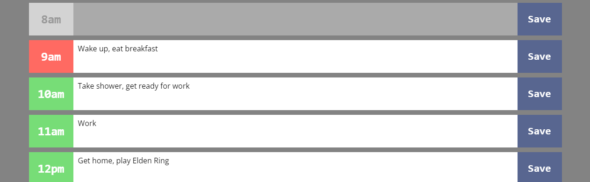
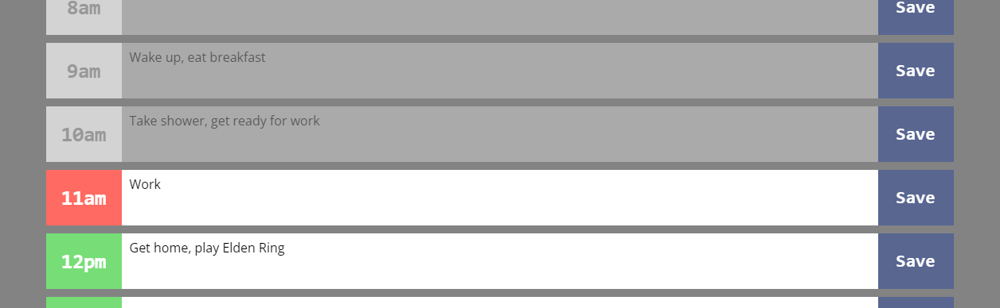

# Work Day Scheduler (Version 1.0.0)

## **About**

[View deployment here.]()

Work Day Scheduler is a webpage that lists every hour of the day (12am-11:59pm) as a new row. Inside of each row, you can write down some task that you wish to accomplish within that given hour. Here's an example:

The current hour is depicted with the red background color, the upcoming hours are depicted in green, and previous hours are gray. 

Once the current hour has passed and it has become grayed-out, you can **no longer edit the text within that row.** It will remain there until the next day has begun, and then **all task information will be deleted.**

To **save** a task, simply click on the blue 'Save' button to the far right.

## **Features**

Here are some cool features of Work Day Scheduler:

- **Completely graphically responsive to all devices**
- **Accurate to your local time**
- **Auto-clears tasks at the start of every new day**
- **Auto-updates user interface as hour changes**
- **Uses Local Storage to save your data locally**

Powered by: 

* **JavaScript** + jQuery

* **CSS** + Bootstrap

* **HTML 5**

## **bugs**

- No known bugs

## **Contact Me**

If you have any questions, concerns, or ideas, reach me by email at: _williamjosephhorn@gmail.com_